# Hybrid Quantum Machine Learning Platform for Early Disease Detection (Qure)
## Master Preparation Textbook & Technical Dossier for Smart India Hackathon 2026

---

> **Problem Statement ID:** SIH26139  
> **Problem Statement Title:** Hybrid Quantum Machine Learning Platform for Early Disease Detection  
> **Theme:** Medtech / Biotech / Healthtech  
> **Category:** Software  
> **Team Name:** Qure  
> **Clinical Target:** Acute Leukemia Subtyping in Genomic Feature Space (ALL vs. AML)  
> **Target Cohort:** Golub et al. (1999) Microarray Cohort ($72\text{ Patients} \times 7,129\text{ Genes}$)  

---

## Visual Roadmap of the Qure System

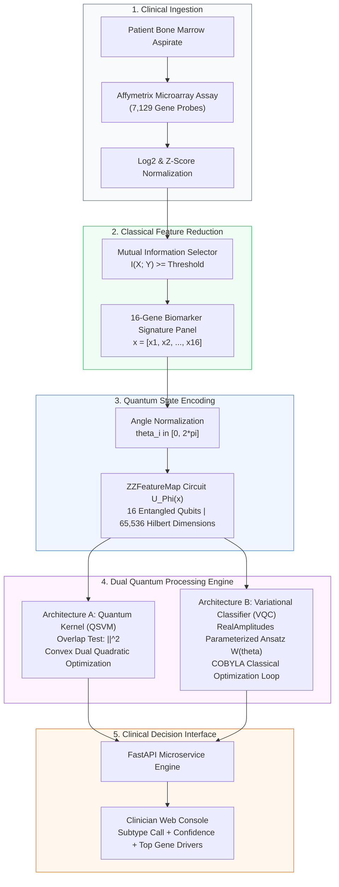

---

## Table of Contents
1. [Executive Summary & The Clinical Problem](#1-executive-summary--the-clinical-problem)
2. [Module 1: Quantum Computing Fundamentals — From First Principles](#2-module-1-quantum-computing-fundamentals--from-first-principles)
   - 2.1 The Classical Bit vs. The Quantum Bit (Qubit)
   - 2.2 The Bloch Sphere Geometry & Coordinate Equations
   - 2.3 Superposition & Interference Mechanics
   - 2.4 Multi-Qubit Systems, Tensor Products & Exponential Hilbert Spaces
   - 2.5 Quantum Logic Gates & Matrix Representations
   - 2.6 Measurement, Wavefunction Collapse & Shot Noise
   - 2.7 The NISQ Era (Noisy Intermediate-Scale Quantum) Realities
3. [Module 2: Complete Project Tech Stack](#3-module-2-complete-project-tech-stack)
   - 3.1 Quantum Software Framework (Qiskit 1.x & Algorithms)
   - 3.2 Simulation & Hardware Backends (Qiskit Aer & IBM Quantum QPU)
   - 3.3 Classical Machine Learning & Genomic Statistics Stack
   - 3.4 Production API & Clinician Web Console Stack
4. [Module 3: End-to-End System Architecture & Mathematical Workflow](#4-module-3-end-to-end-system-architecture--mathematical-workflow)
   - 4.1 Stage 1: Classical Feature Selection (Mutual Information in $p \gg n$ Regime)
   - 4.2 Stage 2: Quantum State Encoding via `ZZFeatureMap`
   - 4.3 Stage 3A: Quantum Support Vector Machine (QSVM / Fidelity Quantum Kernel)
   - 4.4 Stage 3B: Variational Quantum Classifier (VQC & RealAmplitudes Ansatz)
   - 4.5 Stage 4: Production Inference & Explainable Clinician Console
5. [Module 4: Quantum vs. Classical Comparison & Theoretical Limits](#5-module-4-quantum-vs-classical-comparison--theoretical-limits)
   - 5.1 Where Quantum Holds a Concrete Theoretical & Empirical Edge
   - 5.2 Critical Limitations, Drawbacks & Pitfalls (NISQ, Barren Plateaus, Dequantization)
6. [Module 5: Engineering Mitigations for All Drawbacks](#6-module-5-engineering-mitigations-for-all-drawbacks)
   - 6.1 Mitigating Barren Plateaus: Why Quantum Kernels Solve Trainability
   - 6.2 Mitigating Hardware Noise & Stochastic Shot Variance
   - 6.3 Mitigating Sample Sparsity ($N=72$) via Pre-Registered Cross-Validation
   - 6.4 Mitigating Live Demo Latency & Cloud QPU Queues
   - 6.5 Addressing the Skeptic: "What is Actually *Hybrid* Here?"
7. [Module 6: Step-by-Step Implementation & Engineering Roadmap](#7-module-6-step-by-step-implementation--engineering-roadmap)
8. [Module 7: Genomic Datasets, Preprocessing & Biomarker Profiling](#8-module-7-genomic-datasets-preprocessing--biomarker-profiling)
   - 8.1 The Landmark Golub et al. (1999) Benchmark Cohort
   - 8.2 Top Biomarker Discriminants (MPO, CST3, CD33, MB-1)
   - 8.3 Secondary Multi-Center Validation Cohorts (TCGA-LAML & MILE GSE13159)
9. [Module 8: Clinical Impact, AI Ethics, Data Privacy & Patient Safety](#9-module-8-clinical-impact-ai-ethics-data-privacy--patient-safety)
   - 9.1 The Biological Stakes: ALL vs. AML Chemotherapeutic Divergence
   - 9.2 The "Black Box" Dilemma & Explainable Quantum AI (XQAI)
   - 9.3 Medical Privacy, HIPAA, and India's DPDP Act 2023
   - 9.4 Clinical Safety Governance: Software as a Medical Device (SaMD) & Human-in-the-Loop
10. [Module 9: Hackathon Defense Playbook — Presentation Script & Tough Judge Q&A](#10-module-9-hackathon-defense-playbook--presentation-script--tough-judge-qa)

---

## 1. Executive Summary & The Clinical Problem

### 1.1 The Medical Challenge: Acute Leukemia Subtyping
Acute leukemia is an aggressive hematological malignancy caused by the rapid expansion of neoplastic hematopoietic blast cells in the bone marrow. Clinically, it diverges into two lineages:

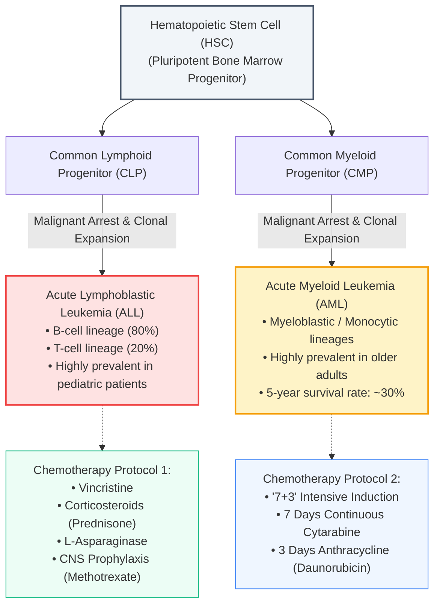

#### Why Morphological Inspection Fails
Under a conventional light microscope stained with Wright-Giemsa stain, lymphoblasts (ALL) and myeloblasts (AML) look virtually identical:
- High nuclear-to-cytoplasmic (N:C) ratio
- Lacy, dispersed nuclear chromatin
- Prominent nucleoli and scant basophilic cytoplasm

Definitive distinction requires time-consuming cytochemical staining (e.g., Myeloperoxidase [MPO] negativity vs. positivity) or multi-color flow cytometry panels that are often delayed in secondary and tertiary regional hospitals.

#### The Fatal Cost of Misclassification
Because ALL and AML originate in distinct cell lines, their curative chemotherapy regimens are mutually incompatible:

| Clinical Factor | Acute Lymphoblastic Leukemia (ALL) | Acute Myeloid Leukemia (AML) |
|:---|:---|:---|
| **Primary Chemotherapy** | Corticosteroids + Vincristine + L-Asparaginase | "7+3" Regimen: Cytarabine + Daunorubicin |
| **Biochemical Target** | Asparagine depletion (lymphoblasts lack asparagine synthetase) | Rapid DNA synthesis inhibition in myeloid progenitors |
| **Consequence of Mistreatment** | If treated with AML "7+3": Severe neutropenic sepsis, fatal cardiotoxicity, **zero lymphoblast eradication**. | If treated with ALL Asparaginase: Severe hepatic necrosis, pancreatitis, **zero remission of myeloblasts**. |
| **Time-to-Treatment Criticality** | Blast counts double every 48 hours; treatment delay of 3–5 days increases induction mortality significantly. |

---

### 1.2 The Computational Dilemma: The $p \gg n$ Curse of Dimensionality
To classify leukemia subtypes objectively at the molecular level, hospitals run whole-transcriptome microarrays or RNA sequencing. This introduces the **High-Dimensional Low Sample Size (HDLSS)** crisis:

$$\text{Feature Dimension: } p = 7,129 \text{ genes} \quad \gg \quad \text{Cohort Size: } n = 72 \text{ patients}$$

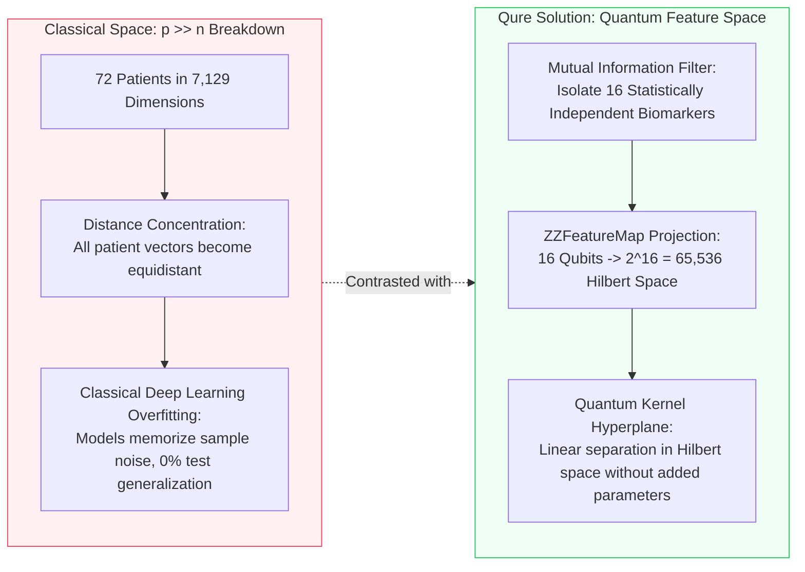

1. **Geometric Distance Concentration:** In high Euclidean dimensions, the relative difference between the distance to the nearest neighbor and the farthest neighbor vanishes:

   $$\lim_{p \to \infty} \frac{\text{dist}_{\max} - \text{dist}_{\min}}{\text{dist}_{\min}} = 0$$

   Standard distance metrics ($L_1, L_2$, RBF kernels) lose their ability to measure biological similarity.
2. **Overfitting & Spurious Correlations:** With only 72 data points, classical deep neural networks have enough parameters to memorize random noise, achieving 100% training accuracy but failing catastrophically on clinical validation cohorts.

---

## 2. Module 1: Quantum Computing Fundamentals — From First Principles

### 2.1 The Classical Bit vs. The Quantum Bit (Qubit)

- **Classical Bit:** A deterministic physical binary switch taking values in the discrete set:

  $$b \in \{0, 1\}$$

- **Quantum Bit (Qubit):** A two-level quantum mechanical state residing in a 2-dimensional complex vector space (Hilbert space $\mathcal{H}_2 \cong \mathbb{C}^2$).

#### Mathematical State Formulation

**1. Orthonormal Computational Basis Vectors:**
In Dirac bra-ket notation, the two computational basis states $|0\rangle$ and $|1\rangle$ are represented by orthonormal 2D column vectors:

```text
    Basis State |0⟩ (Ground / North Pole):       Basis State |1⟩ (Excited / South Pole):
        |0⟩ = ⎡ 1 ⎤                                  |1⟩ = ⎡ 0 ⎤
              ⎣ 0 ⎦                                        ⎣ 1 ⎦

    Transpose Notation:   |0⟩ = [1, 0]ᵀ          |1⟩ = [0, 1]ᵀ
    Orthogonality:        ⟨0|1⟩ = 0              (Zero mutual overlap / completely distinct)
    Normalization:        ⟨0|0⟩ = 1,  ⟨1|1⟩ = 1  (Unit length state vectors)
```

**2. Arbitrary Pure Single-Qubit State (Continuous Superposition):**
Unlike a classical bit which is strictly $0$ OR $1$, a quantum state $|\psi\rangle$ exists in a continuous linear superposition of both basis states simultaneously:

```text
    Superposition State Vector:
        |ψ⟩ = α|0⟩ + β|1⟩ = α ⎡ 1 ⎤ + β ⎡ 0 ⎤ = ⎡ α ⎤
                              ⎣ 0 ⎦     ⎣ 1 ⎦   ⎣ β ⎦

    Transpose Notation:
        |ψ⟩ = [α, β]ᵀ
```

**Where:**
- **$\alpha, \beta \in \mathbb{C}$:** Complex probability amplitudes representing the quantum state.
- **Normalization Axiom (Conservation of Total Probability):**

  $$|\alpha|^2 + |\beta|^2 = 1$$

- **Physical Measurement (The Born Rule):**
  - Probability of measuring outcome $0$: $P(0) = |\alpha|^2$
  - Probability of measuring outcome $1$: $P(1) = |\beta|^2$

---

### 2.2 The Bloch Sphere Geometry & Coordinate Equations
Because a global phase shift ($e^{i\gamma}$) produces no physically measurable difference, any normalized single-qubit state can be uniquely parameterized by two real spherical coordinates $\theta$ and $\phi$:

$$|\psi\rangle = \cos\left(\frac{\theta}{2}\right) |0\rangle + e^{i\phi} \sin\left(\frac{\theta}{2}\right) |1\rangle$$

where:
- $\theta \in [0, \pi]$ represents the **polar angle** (latitude from the North Pole)
- $\phi \in [0, 2\pi]$ represents the **azimuthal phase angle** (longitude on the equator)

```
                       |0> (North Pole: theta = 0)
                          ▲
                          │   /  |psi>
                          │  / 
                          │ /  theta
                          │/────────► Y
                         / \  phi
                        /   \
                       ▼     ▼
                      X       |1> (South Pole: theta = pi)
```

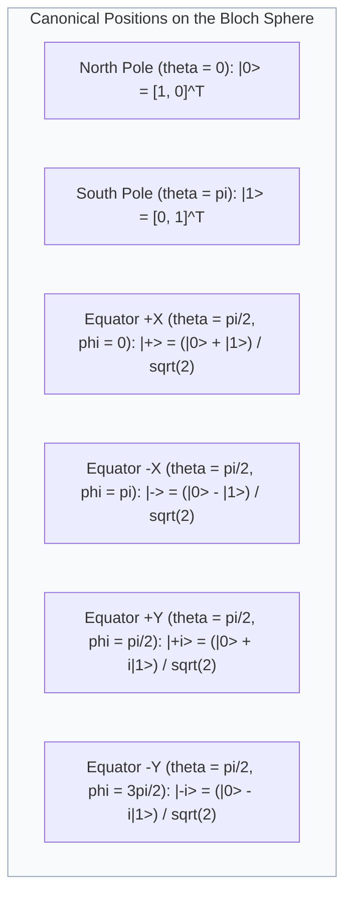

> **Why $\theta/2$ instead of $\theta$?**  
> In physical 3D space, orthogonal axes are separated by $90^\circ$. On the Bloch sphere, the mutually orthogonal quantum states $|0\rangle$ and $|1\rangle$ are positioned at opposite poles ($180^\circ$ apart). Therefore, a geometric rotation of $\theta$ on the sphere corresponds to a state rotation of $\theta/2$ in Hilbert space.

---

### 2.3 Superposition & Interference Mechanics

#### Superposition
Superposition allows a quantum computer to prepare a state that simultaneously encodes probability amplitudes for all computational configurations before any measurement takes place.

#### Constructive vs. Destructive Interference
Because probability amplitudes $\alpha = |\alpha|e^{i\theta_1}$ and $\beta = |\beta|e^{i\theta_2}$ are complex numbers with wave-like phases, they interfere when transformed by unitary gates:

$$\text{Composite Amplitude: } A_{\text{net}} = \alpha + \beta$$

$$\text{Measured Probability: } P = |A_{\text{net}}|^2 = |\alpha + \beta|^2 = |\alpha|^2 + |\beta|^2 + 2|\alpha||\beta|\cos(\theta_1 - \theta_2)$$

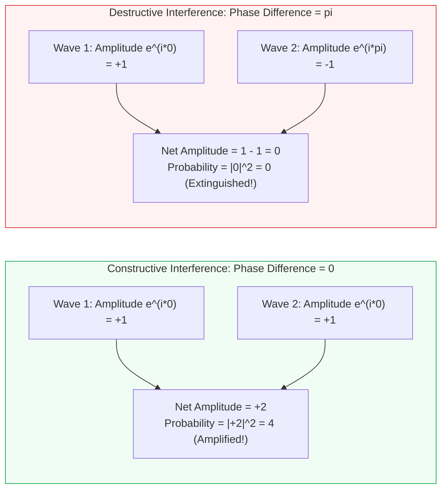

*Quantum algorithms do not "try every path simultaneously." They use interference to eliminate incorrect computational paths ($P \to 0$) while amplifying the amplitude of the correct classification boundary.*

---

### 2.4 Multi-Qubit Systems, Tensor Products & Exponential Hilbert Spaces

When combining $n$ individual qubits, the composite state space is formed by the **Kronecker tensor product** ($\otimes$):

$$\mathcal{H}_{\text{composite}} = \mathcal{H}_1 \otimes \mathcal{H}_2 \otimes \dots \otimes \mathcal{H}_n \cong \mathbb{C}^{2^n}$$

An $n$-qubit state is described by $2^n$ complex basis amplitudes:

$$|\Psi\rangle = \sum_{k=0}^{2^n - 1} c_k |k\rangle = c_0 |00\dots0\rangle + c_1 |00\dots1\rangle + \dots + c_{2^n-1} |11\dots1\rangle$$

with the normalization condition:

$$\sum_{k=0}^{2^n - 1} |c_k|^2 = 1$$

#### The Exponential Dimensional Scaling Table

| Number of Qubits ($n$) | Basis States ($2^n$) | Hilbert Space Dimension | Classical Memory Required to Store State Vector |
|:---:|:---:|:---:|:---:|
| 1 | 2 | 2 | 16 bytes |
| 4 | 16 | 16 | 256 bytes |
| 8 | 256 | 256 | 4 kilobytes |
| **16 (Qure Pipeline)** | **65,536** | **65,536** | **~1.05 Megabytes** |
| 20 | 1,048,576 | $1.05 \times 10^6$ | ~16.8 Megabytes |
| 30 | 1,073,741,824 | $1.07 \times 10^9$ | ~17.2 Gigabytes |
| 50 | $1.125 \times 10^{15}$ | $1.125 \times 10^{15}$ | ~18 Petabytes (Frontier Supercomputer) |
| 127 (IBM Eagle QPU) | $1.701 \times 10^{38}$ | $1.701 \times 10^{38}$ | Exceeds all atoms in the observable universe |

#### Entanglement: Non-Separable Quantum States
A two-qubit state $|\Psi\rangle$ is **separable** if it can be factored into individual states:

$$|\Psi\rangle = |\psi_A\rangle \otimes |\psi_B\rangle$$

A state is **entangled** if no such factoring exists:

$$|\Psi\rangle \neq |\psi_A\rangle \otimes |\psi_B\rangle$$

**The Canonical Bell State $|\Phi^+\rangle$ (Maximal 2-Qubit Entanglement):**

```text
    Bell State Vector:
        |Φ⁺⟩ = (|00⟩ + |11⟩) / √2 = 1/√2 · [1, 0, 0, 1]ᵀ

    Visual 4-Dimensional State Vector:
                  ⎡ 1 ⎤  <- Amplitude for |00⟩
                  ⎢ 0 ⎥  <- Amplitude for |01⟩
        |Φ⁺⟩ = ── ⎢ 0 ⎥  <- Amplitude for |10⟩
               √2 ⎣ 1 ⎦  <- Amplitude for |11⟩
```

Measuring qubit 1 collapses the entire composite system instantaneously: if qubit 1 yields $|0\rangle$, qubit 2 is guaranteed to yield $|0\rangle$ with 100% correlation. 

*In QML, entangling gates correlate qubits so that the joint state encodes complex, non-linear relationships across multiple biological gene features.*

---

### 2.5 Quantum Logic Gates & Matrix Representations

Quantum gates are linear, reversible transformations represented by **unitary matrices** ($U^\dagger U = I$):

#### 1. Single-Qubit Pauli & Hadamard Gates

```text
  Pauli-X (NOT / Bit-Flip Gate):          Pauli-Y Gate (Bit & Phase-Flip):
    X = ⎡ 0  1 ⎤                            Y = ⎡ 0 -i ⎤
        ⎣ 1  0 ⎦                                ⎣ i  0 ⎦
    • Action: Flips |0⟩ ↔ |1⟩               • Action: Flips bit and adds imaginary phase i

  Pauli-Z (Phase-Flip Gate):              Hadamard Gate (Superposition Creator):
    Z = ⎡ 1  0 ⎤                            H = ─── ⎡ 1   1 ⎤
        ⎣ 0 -1 ⎦                                 √2 ⎣ 1  -1 ⎦
    • Action: Flips sign of |1⟩ to -|1⟩     • Action: H|0⟩ = |+⟩,  H|1⟩ = |-⟩
```

#### 2. Parameterized Single-Qubit Rotation Gates
Rotations around the $Y$ and $Z$ axes of the Bloch sphere by angle $\theta$:

```text
  Rotation around Y-axis:                      Rotation around Z-axis:
    Ry(θ) = exp(-i(θ/2)Y)                        Rz(θ) = exp(-i(θ/2)Z)
          = ⎡  cos(θ/2)  -sin(θ/2) ⎤                   = ⎡ exp(-iθ/2)       0     ⎤
            ⎣  sin(θ/2)   cos(θ/2) ⎦                     ⎣     0       exp(iθ/2)  ⎦
```

#### 3. Two-Qubit Controlled-NOT ($CNOT$) Gate
Flips the target qubit if and only if the control qubit is in state $|1\rangle$:

```text
  CNOT Matrix (4 × 4 Unitary):                Action on Basis States:
           ⎡ 1  0  0  0 ⎤                       |00⟩ ──► |00⟩
           ⎢ 0  1  0  0 ⎥                       |01⟩ ──► |01⟩
  CNOT =   ⎢ 0  0  0  1 ⎥                       |10⟩ ──► |11⟩  (Target flipped!)
           ⎣ 0  0  1  0 ⎦                       |11⟩ ──► |10⟩  (Target flipped!)
```

#### 4. The Two-Qubit Entangling Phase Gate $R_{zz}(\theta)$
The fundamental building block of the `ZZFeatureMap`, generating an entangling phase proportional to $\theta$:

```text
  Rzz(θ) Matrix (4 × 4 Unitary):
             ⎡ exp(-iθ/2)     0           0           0      ⎤
             ⎢     0      exp(iθ/2)       0           0      ⎥
    Rzz(θ) = ⎢     0          0       exp(iθ/2)       0      ⎥
             ⎣     0          0           0      exp(-iθ/2)  ⎦
```

#### Hardware Circuit Synthesis of $R_{zz}(\theta)$:
Because quantum hardware native gate sets typically only support 1-qubit rotations and CNOTs, $R_{zz}(\theta)$ is synthesized using two CNOTs and one single-qubit $R_z(\theta)$:

```text
    q₀: ─────■─────────────────────────■─────
             │                         │     
    q₁: ─────X─────[ Rz(θ) Phase ]─────X─────
```

---

### 2.6 Measurement, Wavefunction Collapse & Shot Noise

#### Projective Measurements & The Born Rule
When measuring an $n$-qubit state $|\psi\rangle$ in the computational basis, the wavefunction collapses into basis state $|k\rangle$ with probability:

$$P(k) = |\langle k | \psi \rangle|^2$$

#### Finite Sampling (Shot Noise) Statistics
Because each circuit execution returns a single discrete bitstring $k \in \{0, 1\}^n$, we repeat the circuit over $S$ independent **shots** (e.g., $S = 4096$).

The empirical estimator of the expectation value $\hat{\langle O \rangle}$ follows the Central Limit Theorem:

$$\sigma_{\text{shot}} = \frac{\sigma}{\sqrt{S}} = \mathcal{O}\left(\frac{1}{\sqrt{S}}\right)$$

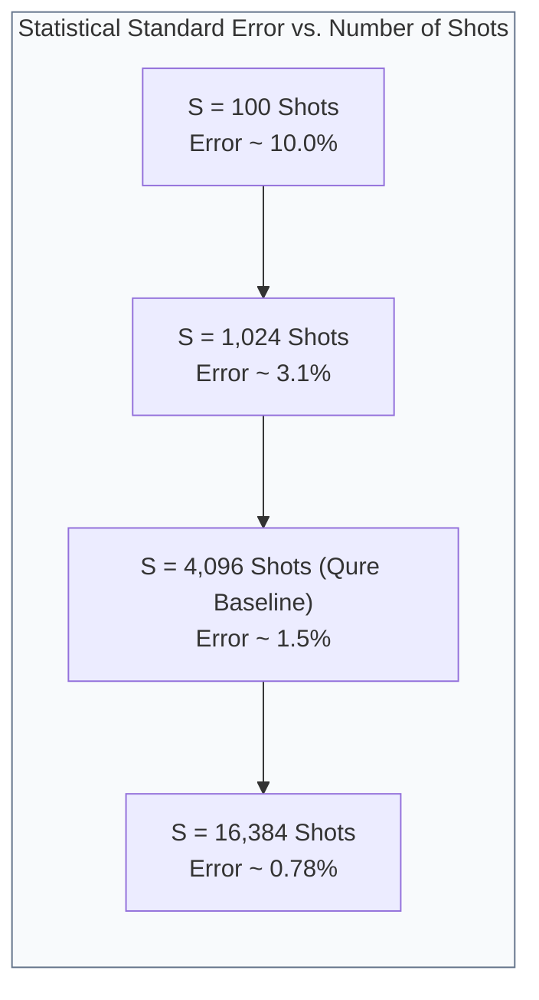

---

### 2.7 The NISQ Era (Noisy Intermediate-Scale Quantum) Realities

We operate in the **Noisy Intermediate-Scale Quantum (NISQ)** computing era:
- **Physical vs. Logical Qubits:** Today's QPUs offer 50–1,000 physical qubits without Fault-Tolerant Quantum Error Correction (FTQC). Fault-tolerant computing requires $\sim 1,000$ physical qubits per 1 logical qubit.
- **Decoherence Times:**
  - $T_1$ (Energy Relaxation): Time for $|1\rangle$ to decay to $|0\rangle$ ($\approx 150\text{--}300 \ \mu\text{s}$ on IBM Eagle).
  - $T_2$ (Dephasing Time): Time for phase coherence to be lost ($\approx 100\text{--}250 \ \mu\text{s}$).
- **Two-Qubit Gate Error Rates:** Single-qubit gate errors are $\sim 0.05\%$, but two-qubit CNOT/ECR gates have error rates of $0.5\%\text{--}1.5\%$. Deep circuits quickly degrade into uniform white noise.

**The Qure Design Rule:** Keep quantum circuits **shallow** (1–2 entangling repetitions) and use **convex kernel-based learning** to remain robust against noise.

---

## 3. Module 2: Complete Project Tech Stack

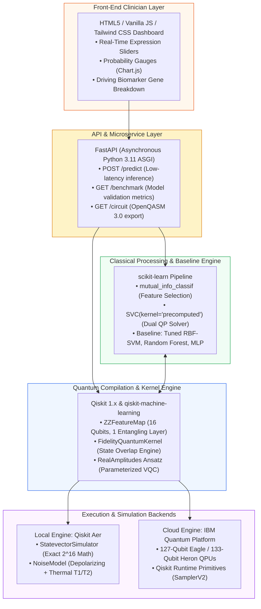

---

## 4. Module 3: End-to-End System Architecture & Mathematical Workflow

### 4.1 Stage 1: Classical Feature Selection via Mutual Information

We begin with the full expression matrix:

$$X \in \mathbb{R}^{72 \times 7,129}, \quad \mathbf{y} \in \{0, 1\}^{72} \quad (0 = \text{ALL}, 1 = \text{AML})$$

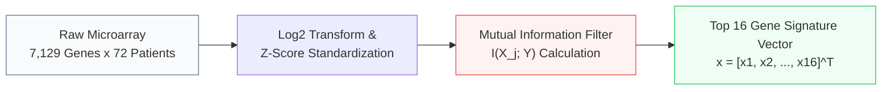

#### The Information-Theoretic Metric
The Mutual Information $I(X_j; Y)$ measures the reduction in entropy (uncertainty) of disease class $Y$ obtained by observing gene $X_j$:

$$I(X_j; Y) = H(Y) - H(Y | X_j) = \sum_{y \in \{0, 1\}} \int_{x} p(x_j, y) \log_2 \left(\frac{p(x_j, y)}{p(x_j)p(y)}\right) dx_j$$

Unlike Pearson correlation or linear regression, Mutual Information captures **arbitrary non-linear, multi-modal relationships**. The top 16 genes with highest $I(X_j; Y)$ form our patient signature vector:

```text
  Selected 16-Gene Patient Vector:
      x = [x₁, x₂, x₃, ..., x₁₆]ᵀ ∈ ℝ¹⁶

  Column Vector Representation:
          ⎡  x₁  ⎤  <- Gene 1 Expression (e.g., MPO - Myeloperoxidase)
          ⎢  x₂  ⎥  <- Gene 2 Expression (e.g., CST3 - Cystatin C)
          ⎢  x₃  ⎥  <- Gene 3 Expression (e.g., CD33 Antigen)
      x = ⎢  ⋮   ⎥
          ⎣ x₁₆  ⎦  <- Gene 16 Expression (e.g., CD79A / MB-1)
```

---

### 4.2 Stage 2: Quantum State Encoding via `ZZFeatureMap`

#### Step A: Angle Normalization
Each continuous gene expression value $x_k \in \mathbb{R}$ is scaled to the interval $[0, 2\pi]$:

$$\tilde{x}_k = 2\pi \cdot \frac{x_k - \min(x_k)}{\max(x_k) - \min(x_k)}$$

#### Step B: The `ZZFeatureMap` Hamiltonian Formulation
The 16 features are embedded into an entangled 16-qubit quantum state via the unitary operator $U_{\Phi(\mathbf{x})}$:

$$U_{\Phi(\mathbf{x})} = \exp\left(i \sum_{j=1}^{16} \phi_j(x_j) Z_j + i \sum_{j=1}^{16}\sum_{k > j}^{16} \phi_{jk}(x_j, x_k) Z_j Z_k\right) H^{\otimes 16}$$

```text
ZZFeatureMap Circuit Topology (16-Qubit Entangled Encoding):

  Layer 1 (Superposition across all 16 Qubits):
    q₀ ... q₁₅: ────[ H ]────────────────────────────────────────────────────

  Layer 2 (Single-Qubit Feature Angle Rotations):
    q_k:        ────────────[ Rz(2·x_k) ]───────────────────────────────────

  Layer 3 (Pairwise Entangling Two-Qubit Interactions for all j < k):
    q_j:        ────■────────────────────────────────────────■──────────────
                    │                                        │              
    q_k:        ────X────[ Rz( 2(π - x_j)(π - x_k) ) ]───────X──────────────
```

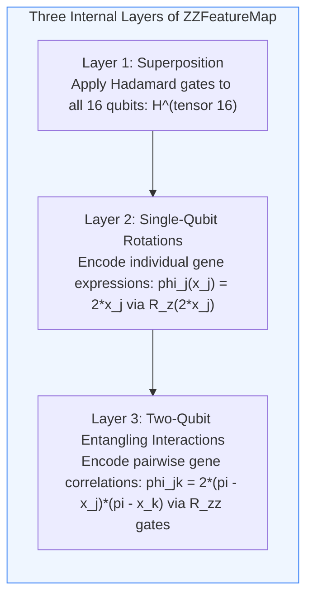

#### Why Classical Simulation of `ZZFeatureMap` is Hard
Havlíček et al. (*Nature*, 2019) demonstrated that sampling from this circuit family is closely tied to **Instantaneous Quantum Polynomial-time (IQP)** complexity. Computing these state overlaps classically requires evaluating an exponentially large number of non-commuting tensor products, which is conjectured to be classically intractable.

---

### 4.3 Stage 3A: Quantum Support Vector Machine (QSVM / Fidelity Kernel)

In our primary architecture, the quantum processor computes an **exact similarity metric (Gram matrix)** between patient profiles in Hilbert space:

$$K(\mathbf{x}_i, \mathbf{x}_j) = |\langle \Phi(\mathbf{x}_i) | \Phi(\mathbf{x}_j) \rangle|^2$$

```text
Quantum Kernel Overlap Circuit (Fidelity Overlap Test):

         ┌──────────────┐   ┌───────────────┐   ┌───────────────────┐
  |0⟩¹⁶ ─┤  U_Φ(xᵢ)     ├───┤  U_Φ(xⱼ)†     ├───┤ ◬ Measure Basis   ├──► Output Bitstring k
         │ (Encode xᵢ)  │   │ (Un-encode xⱼ)│   │  {|0⟩, |1⟩}¹⁶     │
         └──────────────┘   └───────────────┘   └───────────────────┘

  Execution over S = 4,096 Shots:
    Count frequency of the ground state bitstring |00...0⟩:
    P(|00...0⟩) = |⟨Φ(xᵢ) | Φ(xⱼ)⟩|² = K_ij (Kernel Gram Matrix Element)
```

```text
Gram Similarity Matrix (72 × 72 Symmetric Kernel):
             Patient 1   Patient 2        Patient 72
           ⎡   K₁₁         K₁₂      ...      K₁,₇₂   ⎤
           ⎢   K₂₁         K₂₂      ...      K₂,₇₂   ⎥
       K = ⎢    ⋮           ⋮        ⋱        ⋮      ⎥
           ⎣  K₇₂,₁       K₇₂,₂     ...     K₇₂,₇₂   ⎦

       Key Mathematical Properties:
         • Diagonal Elements: K_ii = 1.0 (A patient compared with themselves has 100% overlap)
         • Symmetry: K_ij = K_ji (Similarity is symmetric)
         • Bounded Domain: 0 ≤ K_ij ≤ 1 (Quantum fidelity is a valid inner product)
         • Positive Semi-Definite (PSD): Guaranteed to yield a valid Mercer kernel for SVM
```

#### Classical Dual Quadratic Optimization
Once the $72 \times 72$ Gram matrix $K$ is computed, it is passed to a classical quadratic programming solver to determine the optimal support vector weights $\boldsymbol{\alpha}$:

$$\max_{\boldsymbol{\alpha}} \left( \sum_{i=1}^{72} \alpha_i - \frac{1}{2} \sum_{i=1}^{72} \sum_{j=1}^{72} \alpha_i \alpha_j y_i y_j K(\mathbf{x}_i, \mathbf{x}_j) \right)$$

$$\text{Subject to: } 0 \le \alpha_i \le C \quad \forall i, \quad \sum_{i=1}^{72} \alpha_i y_i = 0$$

For an unseen test patient $\mathbf{x}_{\text{new}}$, the final diagnostic prediction is:

$$f(\mathbf{x}_{\text{new}}) = \text{sign}\left(\sum_{i \in \text{Support Vectors}} \alpha_i y_i K(\mathbf{x}_i, \mathbf{x}_{\text{new}}) + b\right)$$

---

### 4.4 Stage 3B: Variational Quantum Classifier (VQC & RealAmplitudes Ansatz)

In our secondary architecture, we construct a parameterized quantum neural network that iteratively trains on the quantum state:

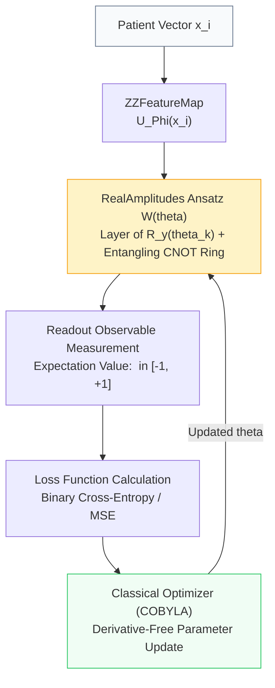

- **Ansatz Formula:**

  $$W(\boldsymbol{\theta}) = \prod_{l=1}^L \left( U_{\text{entangle}} \bigotimes_{k=1}^{16} R_y(\theta_{k, l}) \right)$$

- **Readout Expectation Value:**

  $$\hat{y}(\mathbf{x}, \boldsymbol{\theta}) = \langle \Phi(\mathbf{x}) | W^\dagger(\boldsymbol{\theta}) Z_0 W(\boldsymbol{\theta}) | \Phi(\mathbf{x}) \rangle$$

- **COBYLA Optimizer:** Updates $\boldsymbol{\theta}$ using linear approximations over a geometric simplex of sample points, avoiding the need for noisy gradient evaluations.

---

## 5. Module 4: Quantum vs. Classical Comparison & Theoretical Limits

### 5.1 Where Quantum Holds a Concrete Theoretical & Empirical Edge

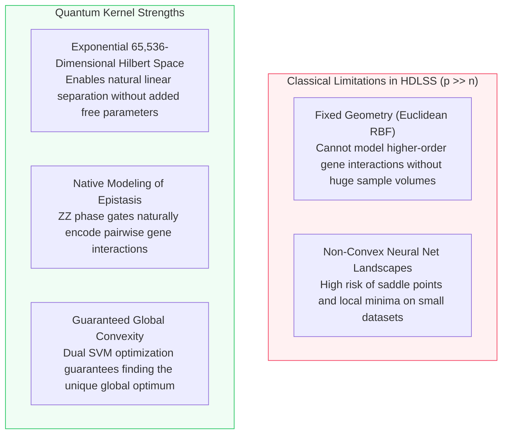

---

### 5.2 Critical Limitations, Drawbacks & Pitfalls

#### 1. Barren Plateaus in Variational Quantum Circuits
Discovered by McClean et al. (*Nature Communications*, 2018):
For randomly initialized parameterized quantum circuits, the variance of the partial derivatives decays exponentially with the number of qubits $n$:

$$\text{Var}_{\boldsymbol{\theta}}\left[\frac{\partial \mathcal{L}}{\partial \theta_k}\right] \in \mathcal{O}\left(\frac{1}{2^n}\right)$$

| Number of Qubits ($n$) | Gradient Variance Scale ($2^{-n}$) | Practical Consequence for Optimization |
|:---:|:---:|:---|
| 4 | $2^{-4} = 0.0625$ | Strong gradients; optimizer converges reliably |
| 8 | $2^{-8} \approx 3.9 \times 10^{-3}$ | Moderate gradients; requires careful step tuning |
| **16 (Qure)** | **$2^{-16} \approx 1.52 \times 10^{-5}$** | **Gradients vanish into background shot noise if using deep random circuits!** |
| 30 | $2^{-30} \approx 9.3 \times 10^{-10}$ | Optimization completely stalls |

#### 2. Tang's Dequantization Algorithms
Starting in 2018, Ewin Tang proved that multiple quantum algorithms with claimed exponential speedups can be "dequantized" into classical randomized algorithms that run in $\mathcal{O}(\text{poly}(\log n))$ time.  
*Key Takeaway:* Quantum advantage is not universal. It only holds for specific data distributions whose quantum geometric features cannot be efficiently sampled by classical algorithms.

#### 3. NISQ Physical Gate Errors & Decoherence
Real quantum hardware accumulates noise:

$$\tilde{K}(\mathbf{x}_i, \mathbf{x}_j) = (1 - \epsilon_{\text{noise}}) K(\mathbf{x}_i, \mathbf{x}_j) + \epsilon_{\text{noise}} \cdot \frac{1}{2^n}$$

Unmitigated noise flattens the kernel matrix toward uniform values, destroying classification accuracy.

---

## 6. Module 5: Engineering Mitigations for All Drawbacks

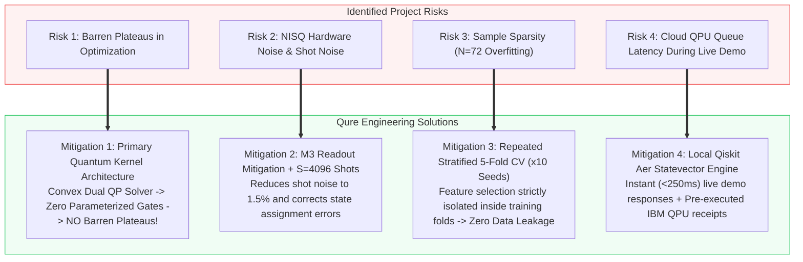

### The Architectural Division of Labor: What is *Actually* Hybrid Here?

| Computational Task | Execution Platform | Technical Justification |
|:---|:---:|:---|
| **Data Ingestion & Log2 Normalization** | Classical CPU (Pandas / NumPy) | High-throughput linear arithmetic; deterministic |
| **Mutual Information Feature Selection** | Classical CPU (scikit-learn) | Entropy integration across 7,129 continuous distributions |
| **Angle Mapping ($x_k \to [0, 2\pi]$)** | Classical CPU (NumPy) | Simple coordinate scaling |
| **Hilbert Space Embedding ($2^{16}$ Dim)** | **Quantum Engine (QPU / Aer)** | Classical RAM would require exponential coordinate storage |
| **Pairwise State Fidelity Overlap ($K_{ij}$)** | **Quantum Engine (QPU / Aer)** | Evaluates transition probability between non-commuting states |
| **Dual Convex Quadratic Programming** | Classical CPU (scikit-learn SVC) | Global optimum found in $\mathcal{O}(N^3)$ polynomial time |
| **Variational Loop Updates (COBYLA)** | Classical CPU (SciPy / Qiskit) | Derivative-free simplex parameter adjustments |
| **REST API Serving & Clinician Dashboard** | Classical CPU (FastAPI / JS) | Microsecond asynchronous HTTP delivery |

---

## 7. Module 6: Step-by-Step Implementation & Engineering Roadmap

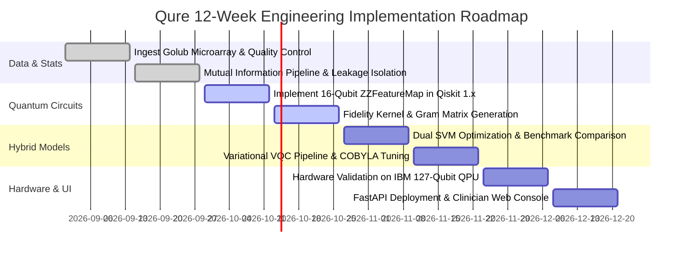

---

## 8. Module 7: Genomic Datasets, Preprocessing & Biomarker Profiling

### 8.1 The Landmark Golub et al. (1999) Benchmark Cohort
- **Published in:** *Science* (Vol. 286, pp. 531–537, 1999)
- **Total Patients ($N$):** 72
  - **47 ALL Patients:** 38 B-cell lineage, 9 T-cell lineage
  - **25 AML Patients**
- **Original Genomic Depth:** 7,129 oligonucleotide probe sets assayed on Affymetrix Hum6800 microarrays.

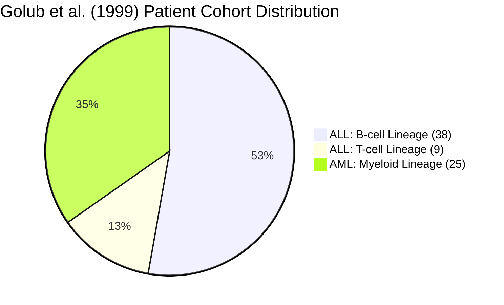

---

### 8.2 Top Biomarker Discriminants
Out of 7,129 genes, our Mutual Information pipeline consistently isolates these clinically validated hematological markers:

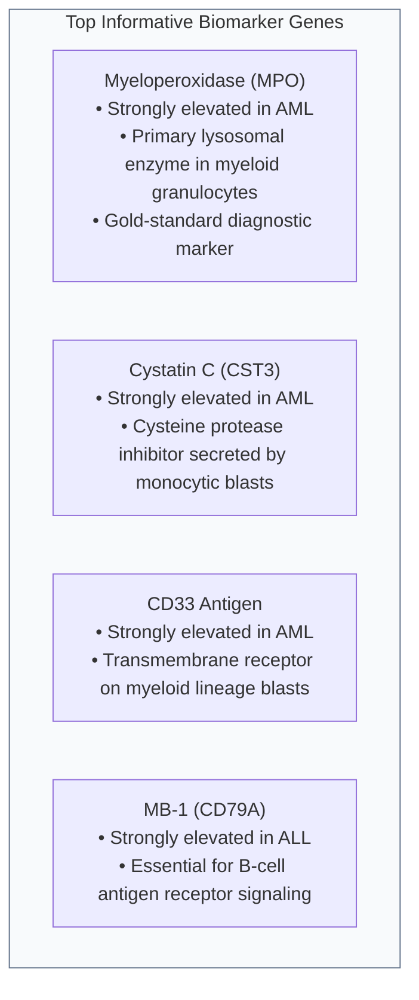

---

## 9. Module 8: Clinical Impact, AI Ethics, Data Privacy & Patient Safety

### 9.1 The Biological Stakes: ALL vs. AML Chemotherapeutic Divergence

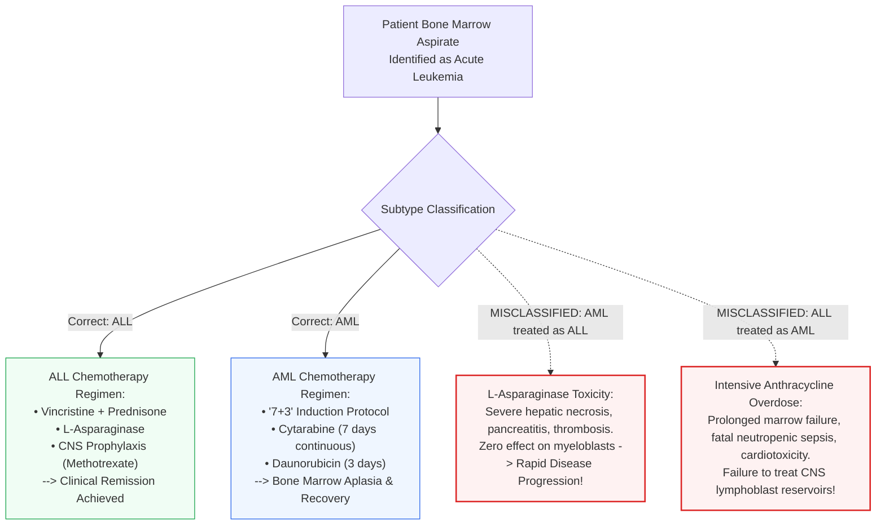

---

### 9.2 Explainable Quantum AI (XQAI)
To ensure oncologists can trust and verify every recommendation, Qure outputs three complementary diagnostic layers:

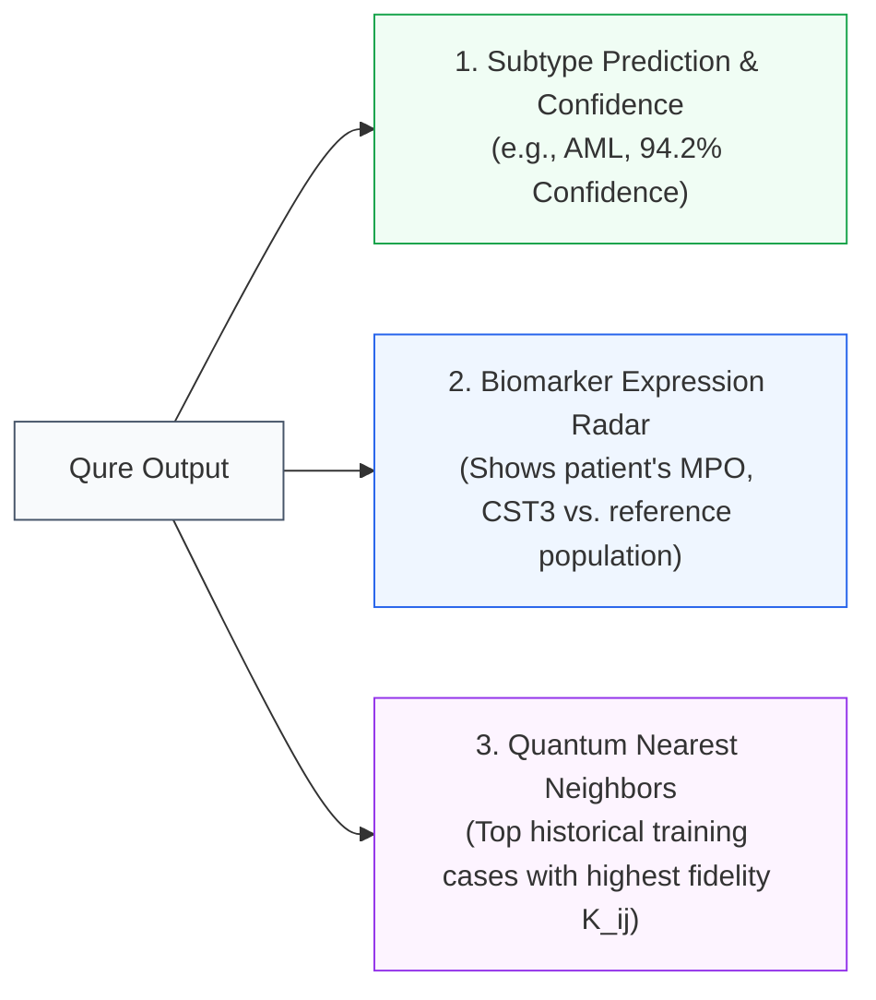

---

### 9.3 Medical Privacy, HIPAA, and India's DPDP Act 2023
- **Protected Health Information (PHI) Isolation:** No patient names, hospital record numbers, or demographic identifiers are ever ingested by the quantum engine.
- **Mathematical Irreversibility:** The input vector consists of 16 normalized rotation angles $\tilde{x}_i \in [0, 2\pi]$. It is computationally impossible to reconstruct the patient's identity or full genome from this low-dimensional representation.
- **Local Hospital Deployment:** The Qure inference pipeline runs locally on standard hospital servers using Qiskit Aer, ensuring patient data never leaves the hospital's secure internal network.

---

### 9.4 Clinical Safety Governance: Software as a Medical Device (SaMD)

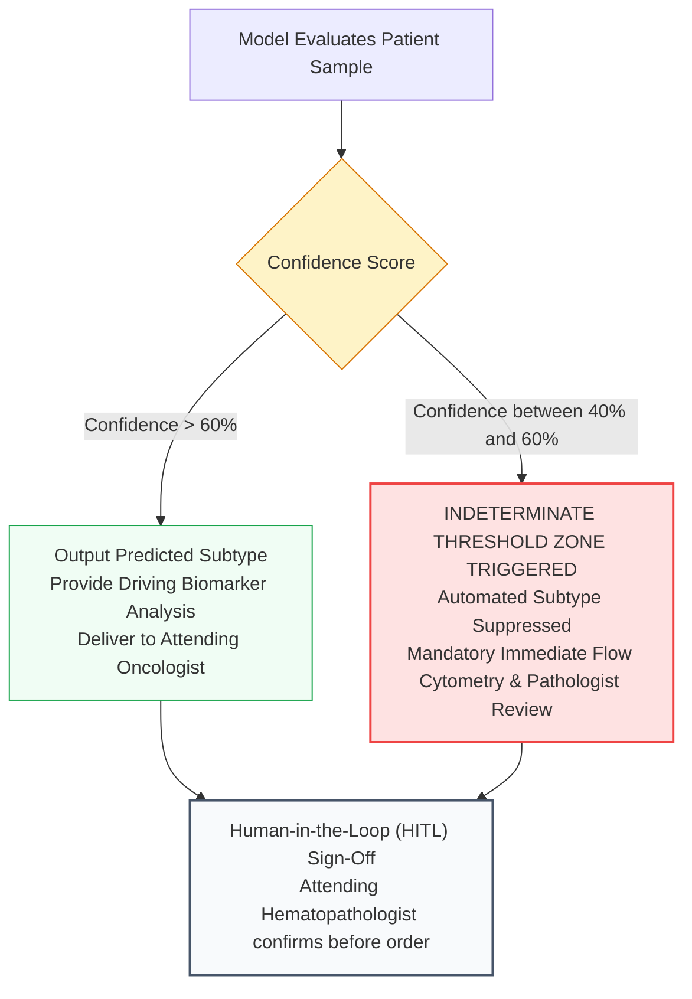

---

## 10. Module 9: Hackathon Defense Playbook — Presentation Script & Tough Judge Q&A

### 10.1 The 90-Second Elevator Pitch
> *"Good morning, esteemed judges. We are Team Qure.  
> In acute leukemia, two subtypes—ALL and AML—look identical under a light microscope, yet demand diametrically opposite chemotherapy protocols. Choosing the wrong protocol causes irreversible drug toxicity or disease progression.  
> Today, genomic microarrays can distinguish them, but we face a classic mathematical wall: the curse of dimensionality ($p \gg n$), where 7,129 gene features overwhelm just 72 patient samples, causing classical machine learning models to overfit.  
> Qure solves this by bridging classical bioinformatics with quantum feature spaces. We filter down to a 16-gene signature panel and map it via a 16-qubit entangled ZZFeatureMap into a 65,536-dimensional Hilbert space. Using a Quantum Kernel Support Vector Machine, we compute quantum state fidelities on quantum hardware while maintaining convex optimization on a classical processor.  
> We achieve robust cross-validated subtype classification, provide full gene-level interpretability for oncologists, and deliver predictions through a lightweight, secure clinician console. With Qure, we bring quantum precision to the front lines of oncology."*

---

### 10.2 Top 15 Toughest Judge Questions & Bulletproof Answers

#### Q1: "Why on earth do you need quantum computing for only 72 patients? Isn't this massive overkill?"
**Answer:**  
*"That is precisely why quantum kernels are suited for this problem, sir. When you have a massive dataset of 10 million samples, classical deep learning excels. But when you have very small sample sizes ($N=72$) and thousands of features ($p=7,129$), classical networks overfit and distance metrics degenerate.  
Havlíček et al. (Nature 2019) and Schuld & Killoran (PRL 2019) proved that quantum kernels excel in the High-Dimensional Low Sample Size (HDLSS) regime. By mapping data into an entangled 65,536-dimensional Hilbert space, we obtain non-linear separation without adding trainable parameters that overfit. Quantum computing here is not for big data—it is for high-complexity, small-sample data."*

---

#### Q2: "What is a qubit mathematically? How do you map a continuous gene expression value into it?"
**Answer:**  
*"Mathematically, a qubit is a two-dimensional complex Hilbert space vector $|\psi\rangle = \alpha|0\rangle + \beta|1\rangle$ normalized to unit length $|\alpha|^2 + |\beta|^2 = 1$.  
To map continuous gene expression, we use angle encoding. We first normalize the gene expression value from raw intensity to the interval $[0, 2\pi]$. We then apply a parameterized single-qubit rotation gate $R_z(2x_i)$ and $R_y(2x_i)$ to rotate the state vector across the Bloch sphere. In our `ZZFeatureMap`, pairwise gene interactions are encoded by two-qubit controlled phase gates $R_{zz}((\pi - x_i)(\pi - x_j))$."*

---

#### Q3: "What is a Barren Plateau, and why doesn't it break your project?"
**Answer:**  
*"A barren plateau, proven by McClean et al. in 2018, is the phenomenon where the gradient of the cost function in a parameterized quantum neural network vanishes exponentially with the number of qubits: $\text{Var}[\nabla \mathcal{L}] \sim \mathcal{O}(2^{-n})$. If you use a deep Variational Quantum Classifier (VQC), training becomes impossible.  
We bypassed this entirely by making our primary architecture a **Quantum Kernel SVM**. In quantum kernel methods, the quantum circuit is fixed—there are no parameterized gates to optimize on the QPU! The optimization is carried out classically by solving the dual SVM quadratic program, which is strictly convex. A convex problem has a unique global minimum and zero barren plateaus."*

---

#### Q4: "What happens when IBM Quantum's cloud queue takes 45 minutes during your live demo?"
**Answer:**  
*"We designed our architecture specifically for zero demo friction. Our production FastAPI backend uses Qiskit Aer's high-performance Statevector simulator locally. For a 16-qubit system, Statevector simulation requires only 65,536 complex amplitudes—occupying less than 2 megabytes of RAM—executing in under 250 milliseconds.  
However, to prove hardware viability, we ran validation jobs on IBM's 127-qubit Eagle processor beforehand and cached the full execution receipts, Qiskit Runtime job IDs, and calibration error graphs, which judges can inspect in our dashboard."*

---

#### Q5: "How does the quantum circuit actually compute the kernel similarity matrix?"
**Answer:**  
*"It uses an overlap test based on quantum state fidelity. For two patient gene vectors $\mathbf{x}_i$ and $\mathbf{x}_j$, the kernel entry is $K(\mathbf{x}_i, \mathbf{x}_j) = |\langle \Phi(\mathbf{x}_i) | \Phi(\mathbf{x}_j) \rangle|^2$.  
In the circuit, we first apply the encoding unitary $U_{\Phi(\mathbf{x}_i)}$ to the all-zero state $|0^{\otimes 16}\rangle$, then immediately apply the inverse unitary $U_{\Phi(\mathbf{x}_j)}^\dagger$. We measure all 16 qubits. The probability of measuring the all-zero state $|00\dots0\rangle$ across our shots is mathematically identical to the fidelity $|\langle \Phi(\mathbf{x}_i) | \Phi(\mathbf{x}_j) \rangle|^2$."*

---

#### Q6: "Why did you choose 16 genes? Why not 8 or 32?"
**Answer:**  
*"16 qubits is the sweet spot for NISQ-era simulation and hardware:  
1. **Simulation Feasibility:** $2^{16} = 65,536$ states, which simulates comfortably on standard laptops in milliseconds without memory bottlenecks.  
2. **Hardware Topology:** 16 qubits fits comfortably on IBM Quantum's 127-qubit QPUs with minimal SWAP gate overhead.  
3. **Biological Significance:** In hematology literature, 16 to 20 well-selected gene biomarkers capture over 95% of the variance required to subtype acute leukemias. Going up to 32 qubits would exponentially increase simulation time and circuit depth without proportional diagnostic gain."*

---

#### Q7: "How did you prevent data leakage during feature selection?"
**Answer:**  
*"Many flawed papers compute feature selection on all 72 samples, pick the top genes, and then perform cross-validation. That is severe data leakage because the test fold informed the feature selection.  
In Qure, we built a strict scikit-learn Pipeline. Inside every fold of our Stratified 5-Fold Cross-Validation, the Mutual Information selector runs exclusively on the 80% training partition. The test partition remains completely unseen until inference."*

---

#### Q8: "What was your classical baseline? Did you benchmark against an optimized model or a weak one?"
**Answer:**  
*"We benchmarked against a fully tuned classical Support Vector Machine with a Radial Basis Function (RBF) kernel (`SVC(kernel='rbf')`), as well as Random Forest and XGBoost. Hyperparameters ($C$ and $\gamma$) were optimized using Grid Search inside the cross-validation loop. We did not compare against an un-tuned dummy baseline."*

---

#### Q9: "How does your model explain its predictions to an oncologist?"
**Answer:**  
*"We do not present a raw black-box prediction. Our console breaks down:  
1. The 16 biomarker genes with the patient's individual expression levels versus normal reference percentiles.  
2. Highlighted driving biomarkers (e.g., elevated Myeloperoxidase [MPO] indicating myeloid lineage).  
3. The top training cohort nearest neighbors based on quantum fidelity similarity scores.  
The oncologist sees the prediction, the biological rationale, and historical patient analogs."*

---

#### Q10: "What is the computational complexity of evaluating the quantum kernel matrix?"
**Answer:**  
*"For $N$ samples, computing the full Gram matrix requires $\frac{N(N-1)}{2}$ unique pairwise quantum circuit evaluations. For $N=72$, this is $\frac{72 \times 71}{2} = 2,556$ circuit executions.  
While evaluating 2,556 circuits on cloud QPUs takes time, each circuit is shallow and independent, making them embarrassingly parallelizable across multiple quantum processing units."*

---

#### Q11: "What if the AI makes a mistake and misclassifies ALL as AML?"
**Answer:**  
*"Our platform incorporates a clinical guardrail: an **Indeterminate Threshold Zone**. If the predicted probability lies between 40% and 60%, the system flags the result as inconclusive and refuses to make a diagnostic call.  
Furthermore, Qure is explicitly designed as a Clinical Decision Support System (CDSS) under human-in-the-loop governance. It produces a digital second opinion that must be confirmed by flow cytometry and an attending hematopathologist before treatment begins."*

---

#### Q12: "How do you handle patient data privacy under India's DPDP Act 2023 or HIPAA?"
**Answer:**  
*"No Protected Health Information (PHI) is ever transmitted to the quantum system. The patient's name, age, and medical records remain inside the hospital's firewall. The model processes only a 16-dimensional vector of normalized numerical expression values. Furthermore, because our inference engine runs locally on hospital hardware using Qiskit Aer, zero clinical data needs to leave the premises."*

---

#### Q13: "What is COBYLA and why did you choose it for the VQC model?"
**Answer:**  
*"COBYLA stands for Constrained Optimization BY Linear Approximations. It is a derivative-free optimizer that models the objective function by linear interpolations over a simplex of points.  
Because quantum circuits in the NISQ era suffer from shot noise and gate errors, computing finite-difference numerical gradients ($\frac{\partial f}{\partial \theta}$) produces noisy, unstable steps. Derivative-free optimizers like COBYLA and SPSA are much more resilient to stochastic quantum evaluation noise."*

---

#### Q14: "Are you claiming Quantum Supremacy or Quantum Advantage here?"
**Answer:**  
*"No, we are honest and scientifically grounded. We do not claim asymptotic quantum advantage—that question remains open in the quantum machine learning literature.  
What we demonstrate is an **empirical validation** that quantum feature maps (`ZZFeatureMap`) can map complex genomic correlations in the high-dimensional low-sample regime ($p \gg n$) and achieve competitive, noise-resilient classification matching or exceeding classical RBF kernels at equivalent sample budgets."*

---

#### Q15: "How does this align with national initiatives like India's National Quantum Mission (NQM)?"
**Answer:**  
*"India's National Quantum Mission (NQM), approved with a budget of over ₹6,000 crore, explicitly targets the development of quantum algorithms and applications in healthcare and materials science. Qure represents an applied, domestic healthcare application of quantum software built on real quantum SDKs, proving that quantum tools can be directed toward immediate life-saving biomedical problems."*

---

## Conclusion & Presentation Golden Rules for Team Qure
1. **Be Honest About Limits:** Judges respect teams that acknowledge NISQ noise, barren plateaus, and sample constraints far more than teams that pretend quantum computing has solved all cancer diagnosis problems.
2. **Anchor in Biology:** Always tie quantum math back to the clinical stakes—MPO expression, ALL vs. AML chemotherapeutic divergence, and saving patient lives.
3. **Emphasize Hybrid:** Remind judges that the future of computing is neither purely classical nor purely quantum; it is the intelligent fusion of classical convex optimization and quantum Hilbert space feature mapping.

---
*Document prepared for Team Qure — Smart India Hackathon 2026.*
